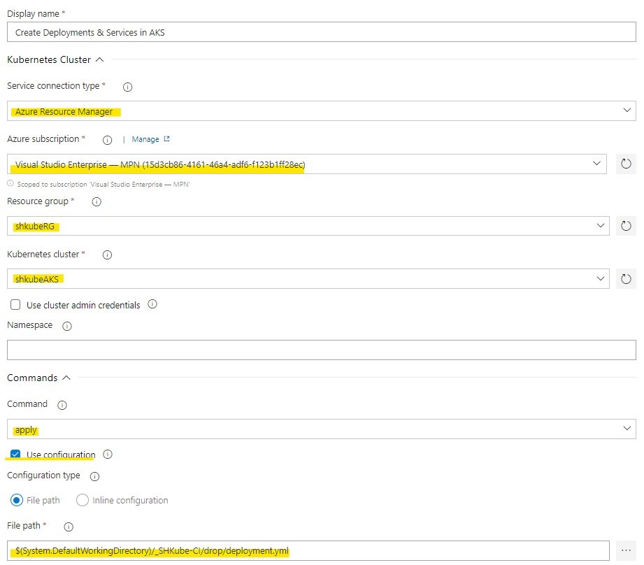

# Using Azure DevOps to build and deploy your application to Azure Kubernetes Service

In this article I will describe how to use Azure DevOps to:
* build a docker image of your application
* push this image to to Azure Container Register
* release your kubernetes deployment to Azure Kubernetes Service

If you don't have a basic knowlage about docker, kubernetes and Azure CLI please check my previous article [Deploying .NET Core Application to Azure Kubernetes Cluster for Less Than 5$](https://softwarehut.com/blog/tech/deploying-net-core-application-to-azure-kubernetes-cluster).

## What are the benefits of automating Continuous Integration and Delivery processes?
* you save a lot oh time 
* you eliminate bugs that happens when you do the same job again and again
* you deliver your product more often and much faster

Azure DevOps can help you with that.

## Azure DevOps
Azure DevOps can automate your Continous Integration and Delivery process.
It can get access to you git repository (Azure Repos Git, GitHub and other git repositories).
It can automaticly react on what you are doing with your repository: 
* run tests when you create a pull request
* build a docker image when you merge your pull request to selected branch and push it to Azure Container Register (ACR)
* when everything is ok it can apply changes to your Azure Kubernetes Service (AKS)

You can use docker images from your ACR to create as many release configuration as you need. 
For example one for dev, test, stage and production environment and decide when you want to release them.

If you don't have your Azure Container Register and Azure Kubernetes Service yet
you can use necessery Azure CLI commands from my prevoous article:

## Azure setup

```
#Create temp variables:
$projectName="shkube"
$argName=$projectName+"RG"
$acrName=$projectName+"ACR"
$aksName=$projectName+"AKS"
$region="northeurope"
```
We are going to use them to create ACR and AKS in Azure Resource Group (ARG).

Login to azure:
```
az login
```
And lets create everyting you will need later:
```
# Create resource group
az group create -n $argName -l $region

# Create azure container register
az acr create -n $acrName -g $argName --sku standard 

# Create azure kubernetes service
az aks create -n $aksName -g $argName --generate-ssh-keys --node-count 1  --node-vm-size Standard_B2s --enable-addons monitoring 

# Get AKS Client Id and AKS Id
$CLIENT_ID=$(az aks show -g $argName -n $aksName --query "servicePrincipalProfile.clientId" --output tsv)
$ACR_ID=az acr show --name $acrName --resource-group $argName --query "id" --output tsv 

# Give AKS access to ACR
az role assignment create --assignee $CLIENT_ID --role acrpull --scope $ACR_ID

# Get credential to your AKS
az aks get-credentials -g $argName -n $aksName
```

Now we can begin to work with your CI/CD

## Prerequirements

If you are reading this article then you probably already have your application up and running
inside Docker Container or even Kubernetes but if not then you need three additional files to do that:
* Dockerfile
* docker-compose.yml
* deployment.yml

If you don't have them you can use mine from [this project](https://github.com/szczepanbh/shkube).

## Azure DevOps
Go to your [azure devops website](https://dev.azure.com/) and create new project
<p align="center">
  
</p>

Create a new pipeline
<p align="center">
  
</p>

I'm going to use classic editor and select github repository so pick your repository 
and a branch which you are going to use to build a container from
<p align="center">
  
</p>

If you see Docker Compose on a list you can use it but I will pick `Empty job`
<p align="center">
  
</p>

Use `+` button to add first step of your pipeline! In this step we will build a new docker image with your application.
We will use `Docker Compose` step that will use your `docker-compose.yml` file.
 <p align="center">
  
</p>

Now there are few things to do:
* select your Azure Subscription
* select Azure Container Register
* put a path to your `docker-compose.yml` file
* change Action to `Build service image`
* and put `$(Build.BuildId)` as Additional Image Tags (without this, we won't be able to determinate which image version to deploy later)
 <p align="center">
  
</p>

Great! Now we have to push this image to our ACR. Lets add second `Docker Compose` step.
The only difference is the Action field: now pick `Push service image`
<p align="center">
  
</p>

The third step is optional but recommended. Locking an image version or a repository so that it can't be deleted or updated.
As before add `Docker Compose` step. The only difference is the Action field. Now pick `Lock image service`.
`Output Docker Compose File` will fille automaticly.
<p align="center">
  
</p>

There are two more steps to add. 

Add `Copy Files` step.
* In `Contents` put a name or path to your `deployment.yml` file (we will use this file during Release)
* In `Target folder` put `$(Build.ArtifactStagingDirectory)`
<p align="center">
  
</p>

And `Publish build artifacts` step. Leave it as is.
<p align="center">
  
</p>

We will use `Artifact name` during Release
If you want your pipeline to trigger automaticly after each merge go to `Triggers` tab and select `Enable continuous integration`
<p align="center">
  
</p>

Click on `Build pipeline` and change `Agent Specification` to use Ubuntu (if you prefere Windows then you will have to change all paths to match Windows)
<p align="center">
  
</p>

Now we can test our pipeline! Hit `Save & queue`.
<p align="center">
  
</p>

Go to Pipelines, select the pipeline you have created and pick the newest Run. If it shines green then everything is ok. 
<p align="center">
  
</p>

If not then you have to check which step want wrong and fix it.
<p align="center">
  
</p>

Congratulations! Half of our plan is ready. We have an image, the image is available on your ACR. Let's check it out. 
Please login to your Azure Portal and check if your image is there (please notify that our image is also tagged by build number).
<p align="center">
  
</p>

Now we can configure new Release

# Azure Releases
Go to `Release` tab and create a new one
<p align="center">
  
</p>

Similary to pipeline configuration I have selected `Empty job`
<p align="center">
  
</p>

Now click on `Add an artifact`, select your project and source.
<p align="center">
  
</p>

Go to `Tasks` tab
<p align="center">
  
</p>

Add `Kubectl` task
<p align="center">
  
</p>

* change `Service connection type`
* select `Azure subscription`
* select `resource group`
* select `Kubernetes claster`
* pick `Apply` Command
* check `Use configuration`
<p align="center">
  
</p>

And pick your `deployment.yml` file in `File path`
<p align="center">
  
</p>

Expand `Advance` and check `Version spec` that match to the version of Kubernetes on Azure.
You can use this command to check the current one:
```
az aks show -g $argName -n $aksName --output table
```
<p align="center">
  
</p>

Add new `Kubectl` step (we will have to replace the name of your docker image to match the one on ACR).
Set everything as before but chance `Command` to `set` and `Arguments` input to
`image deployments/shkube-deployment shkube=shkubeacr.azurecr.io/shkube:$(Build.BuildId)`
This command is tricky, we have to navigate by `name` to deployment and then to container image.
<p align="center">
  
</p>

We are specyfying the image version here, this is better practise then just use `:latest` because 
latest image is always pointing to the newest one (that is created after each merge). 
It could be ok for your dev environment but not for sure for production one.
<p align="center">
  
</p>

Click `Save` and `Create release` (top right) and go to Release to check if everything shines green.
<p align="center">
  
</p>

Ok let's go to console and check your services and pods
<p align="center">
  
</p>

And navigate to IP of your service to check if it is up and running.
<p align="center">
  
</p>

It is working! Congratulation! Your continous integration and delivery setup is ready. You can now use your pipeline to create another `Release` configuration for your test, stage or production environment.
